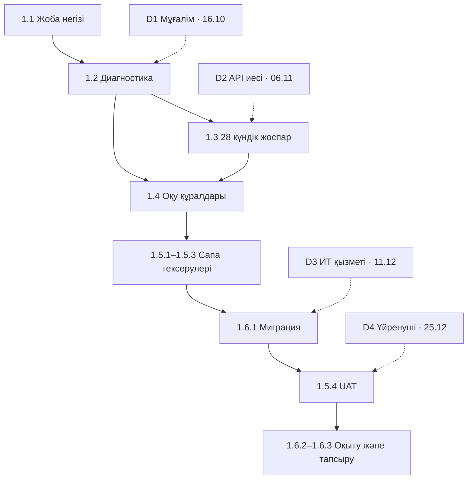

# Тәуелділіктер картасы

Тұтас сызық — ішкі алғышарт; үзік сызық — сыртқы ресурс/кері байланыс. Пакет деңгейіндегі барлық алғышарт [WBS](wbs.md) кестесінде. Бір орындаушы болғандықтан тәуелсіз тармақтар да апталық кестемен кезектеседі.

| ID | Не қажет | Кімнен / байланыс иесі | Растау мерзімі | Еске салу | Блоктайды | Резерв |
|---|---|---|---|---|---|---|
| D1 | Тест ережесін және 5 эталонды қарау | Ағылшын тілі мұғалімі; байланыс иесі Ақжан Расуул | 16.10.2026 | 13.10.2026 | 1.2.2 | Жауап жоқ болса синтетикалық эталонмен техникалық тексеру; педагогикалық қабылдау ашық қалады. |
| D2 | AI API кілті және лимиті туралы шешім | API аккаунтының иесі: Ақжан Расуул | 06.11.2026 | 03.11.2026 | 1.3.1 нақты API сынағы | Кілтсіз 28 күндік mock/fallback; нақты провайдер интеграциясы расталмады деп белгілеу. |
| D3 | Docker/PostgreSQL пилот стенді | ЖОО ИТ қызметі; байланыс иесі Ақжан Расуул | 11.12.2026 | 08.12.2026 | 1.6.1, 1.6.3 | Жергілікті Docker стенді; сыртқы қолжетімділік пен production SLA қабылданбайды. |
| D4 | UAT және оқытуға қатысушы | Пилот үйренушісі; байланыс иесі Ақжан Расуул | 25.12.2026 | 22.12.2026 | 1.5.4, 1.6.2 | Әзірлеуші walkthrough; нақты пайдаланушымен UAT мәртебесі ашық. |

Барлық күндер — растауды алу үшін жоспарланған мерзімдер; келісім алынды деген сөз емес. Сыртқы рөлдерге нақты адамдар әлі бекітілмеген. Ақжан Расуул әр мерзімде келісім дәлелін немесе резервке көшу шешімін тіркейді. ICS файлын импорттағаннан кейін оқиға мен 3 күндік еске салғыш көрінуін тексеру қажет.
